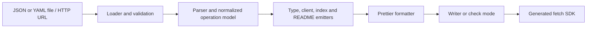

# Architecture

The loader parses JSON or YAML and checks the OpenAPI version and basic document shape. The parser resolves local component references, merges path and operation parameters, assigns stable names, and describes requests and successful responses. Emitters produce four files from that model. Generated methods build URLs and bodies, then call one shared transport function for headers, fetch, errors, and response parsing. The client accepts a custom `fetch` for tests or networking instrumentation.

The writer validates paths and symbolic links and refuses to write to the working directory or its ancestors. With `--clean`, it writes to a sibling staging directory before replacing the existing output, and restores the previous directory if replacement fails. `--check` compares generated files without writing. The CLI validates arguments and presents core errors with exit codes.

For a new OpenAPI feature, add a small fixture, a generated TypeScript compile test, and a runtime test when request or response behavior changes. Unsupported constructs should produce a useful error instead of a plausible but incorrect type.
